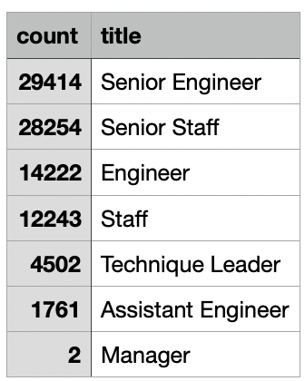
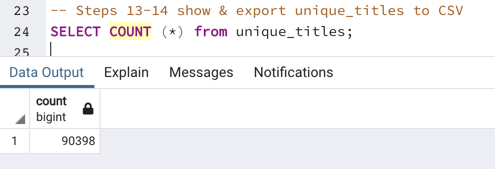
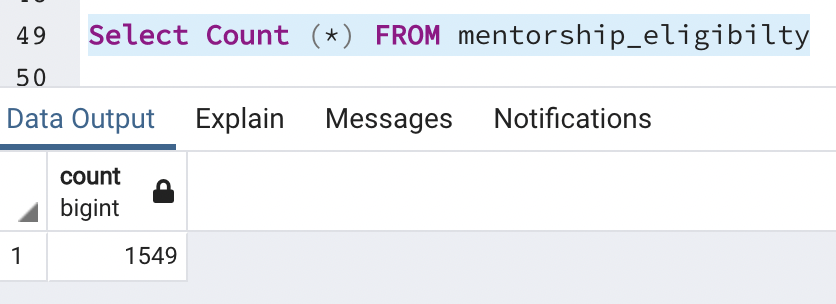

# Pewlett-Hackard-Analysis
## Overview of the analysis:
Using the data provided by Pewlett-Hackard, we used the [employee data](Data/employees.csv) and the [title data](Data/titles.csv) to create a new [file](Data/retirement_titles.csv) to identify employees that are approaching retirment age. 

This work will help the company to:
- proactively prepare to fill the vacancies of soon to retire employees
- identify employees who are eligible for the mentoship program

## Results:
- There are 90,398 employees identified as approaching retirement age.
- There are 29,414 Senior Engineers approaching retirement age, the most for any title.
- The title with the least potential openings are Managers, with only 2. 
- A total of 1,549 employees are eligible for the mentoship program.

 

## Summary: 

### How many roles will need to be filled as the "silver tsunami" begins to make an impact?

90,398 roles will be impacted.

```sql
SELECT COUNT (*) FROM unique_titles;
```
has an output of 90,398 employees.



### Are there enough qualified, retirement-ready employees in the departments to mentor the next generation of Pewlett Hackard employees? 

1,549 retirement-ready employees eligible, enough to mentor the next generation.

```sql
SELECT COUNT (*) FROM mentorship_eligibilty;
```

